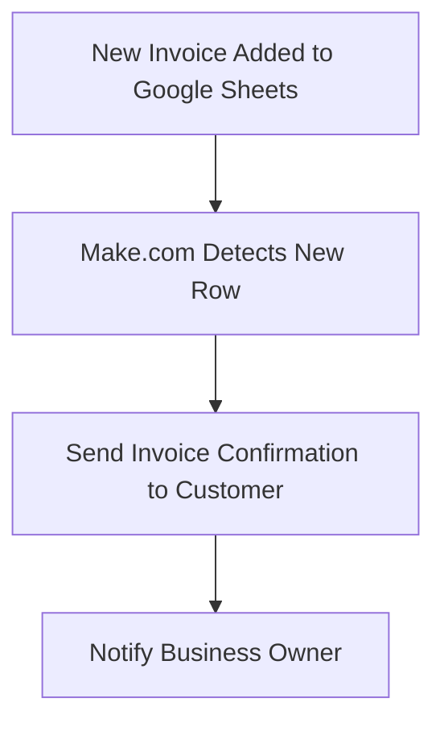
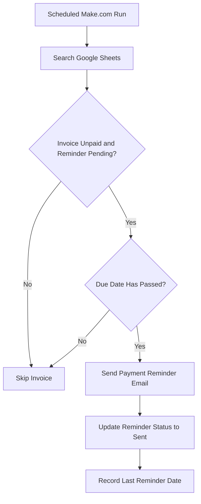

# Workflow Diagram

## Scenario 1: Invoice Confirmation & Owner Notification

```mermaid
flowchart TD
    A[New Invoice Added to Google Sheets] --> B[Make.com Detects New Row]
    B --> C[Send Invoice Confirmation to Customer]
    C --> D[Notify Business Owner]
```

## Scenario 2: Automated Invoice Payment Reminders

```mermaid
flowchart TD
    A[Scheduled Make.com Run] --> B[Search Google Sheets]
    B --> C{Invoice Unpaid and Reminder Pending?}
    C -->|No| D[Skip Invoice]
    C -->|Yes| E{Due Date Has Passed?}
    E -->|No| D
    E -->|Yes| F[Send Payment Reminder Email]
    F --> G[Update Reminder Status to Sent]
    G --> H[Record Last Reminder Date]
```
